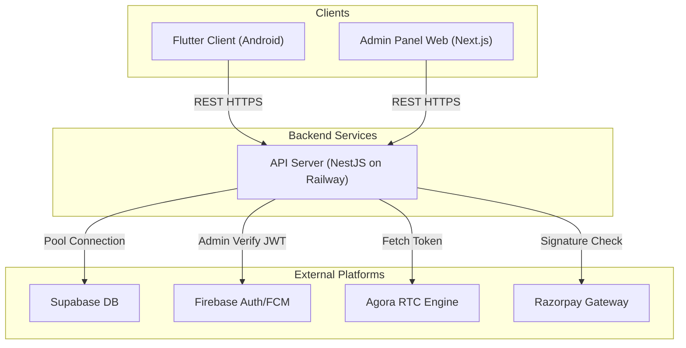

# Production Deployment Guide

This guide describes the complete procedure for deploying and linking the three independent repositories (`backend-api`, `admin-panel`, and `flutter-app`) to their respective hosting providers.

---

## Architecture Flow



---

## 1. GitHub Setup

Split the codebases into three separate GitHub repositories:

1. **`backend-api`**: Code from `backend-api/` directory.
2. **`admin-panel`**: Code from `admin-panel/` directory.
3. **`flutter-app`**: Code from `flutter-app/` directory.

Initialize and push each repository:
```bash
# Repeat for each repository folder (backend-api, admin-panel, flutter-app)
cd <repository-directory>
git init
git add .
git commit -m "Initial release"
git remote add origin https://github.com/username/repository-name.git
git branch -M main
git push -u origin main
```

---

## 2. Backend Deployment: Railway

[Railway](https://railway.app) is used to deploy the NestJS API application.

### Step-by-Step Deployment:
1. Log in to [Railway.app](https://railway.app).
2. Click **New Project** → **Deploy from GitHub repo**.
3. Select your `backend-api` repository.
4. Go to **Variables** and add the required environment variables:
   - `PORT`: `5000`
   - `JWT_SECRET`: Generate a cryptographically strong string.
   - `SUPABASE_URL` & `SUPABASE_SERVICE_ROLE_KEY`: Copied from your Supabase Dashboard settings (API tab).
   - `FIREBASE_PROJECT_ID`, `FIREBASE_CLIENT_EMAIL`, and `FIREBASE_PRIVATE_KEY`: Copied from the generated Firebase Service Account JSON key. Note: private key must contain `\n` characters preserved in double quotes.
   - `AGORA_APP_ID` & `AGORA_APP_CERTIFICATE`: From your Agora Developer Dashboard project.
   - `RAZORPAY_KEY_ID` & `RAZORPAY_KEY_SECRET`: Your Razorpay payment gateway credentials.
5. In **Settings** → **Networking**, click **Generate Domain** to get a public URL (e.g. `https://backend-api-production.up.railway.app`).

---

## 3. Admin Panel Deployment: Vercel

[Vercel](https://vercel.com) is used to deploy the Next.js admin dashboard.

### Step-by-Step Deployment:
1. Log in to [Vercel.com](https://vercel.com).
2. Click **Add New** → **Project**.
3. Select your `admin-panel` repository.
4. Under **Environment Variables**, add:
   - `NEXT_PUBLIC_API_URL`: Your hosted API endpoint with `/api` appended (e.g. `https://api.creomine.com/api`).
5. Click **Deploy**. Vercel will automatically build and serve the console.

---

## 4. Mobile Client Configuration: Flutter

Update the API endpoint url in the Flutter codebase to link the application.

### Step-by-Step Configuration:
1. Open [flutter-app/lib/services/api_config.dart](file:///d:/Flutter%20calling%20android%20app%202026/flutter-app/lib/services/api_config.dart)
2. Change the `baseUrl` variable:
   ```dart
   const String baseUrl = "https://api.creomine.com/api";
   ```
3. Place your production `google-services.json` downloaded from Firebase Console into `flutter-app/android/app/`.
4. Compile release binaries:
   - APK: `flutter build apk --release`
   - App Bundle: `flutter build appbundle --release`
5. Upload the `.aab` file to Google Play Console.

---

## 5. Domain Configuration (DNS)

To configure branded domain mapping:

1. **API Domain**:
   - In Railway Settings → **Custom Domains**, add `api.yourdomain.com`.
   - Add a DNS `CNAME` record in your registrar (e.g. GoDaddy, Cloudflare):
     - Name: `api`
     - Value: `<railway-generated-domain>`
2. **Admin Dashboard Domain**:
   - In Vercel Project Settings → **Domains**, add `admin.yourdomain.com`.
   - Add a DNS `CNAME` record:
     - Name: `admin`
     - Value: `cname.vercel-dns.com`
